  

  
  
  

  

 

##  Estadísticas

  
  

 

##  Stack tecnológico

**Frontend**
 

 

**Backend & Data**
 

 

**DevOps & Tools**
 

 

**AI · Automation · Platforms**
 

 

##  Proyectos destacados

  

 

##  Actividad en GitHub

  

 

  <picture>
    <source media="(prefers-color-scheme: dark)" srcset="https://raw.githubusercontent.com/Harold9893/Harold9893/output/github-contribution-grid-snake-dark.svg">
    <source media="(prefers-color-scheme: light)" srcset="https://raw.githubusercontent.com/Harold9893/Harold9893/output/github-contribution-grid-snake.svg">
    
  </picture>

